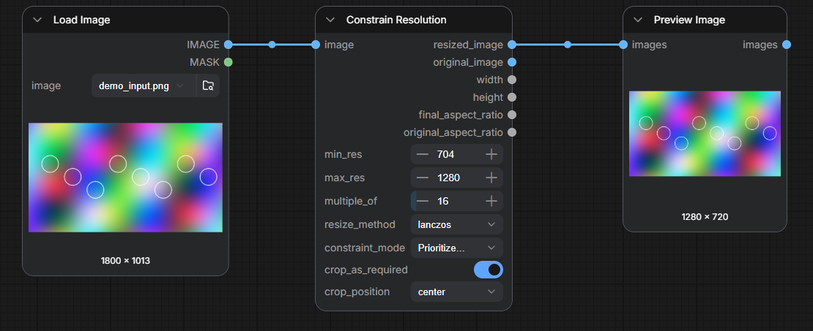
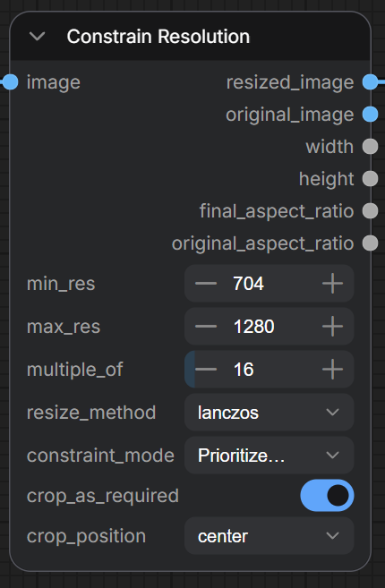

# ComfyUI Constrain Resolution

A [ComfyUI](https://github.com/comfyanonymous/ComfyUI) node that resizes any image to fit your model's resolution rules: a minimum size, a maximum size, and dimensions guaranteed divisible by 2, 8, 16, 32, or 64. It keeps the aspect ratio by cropping a few pixels when needed, so the output is always exactly what strict image-to-image and image-to-video models expect.



In the example above, an 1800×1013 image becomes 1280×720 — within the 704–1280 limits, both dimensions divisible by 16, aspect ratio intact.

## Why

Many models fail or degrade when dimensions are wrong:

- Image-to-video models often require exact sizes with dimensions divisible by 8 or 16
- Diffusion models (Flux, SD, etc.) need dimensions divisible by at least 2, and some run faster at 32/64 alignment
- VRAM limits mean you need a hard cap on resolution

This node applies all three rules in one step and **guarantees divisibility on every output** — resize, round, and crop all land on multiples of your chosen number.

## Inputs



| Input | Default | Purpose |
|---|---|---|
| `image` | — | Image (or batch) to resize |
| `min_res` | 704 | Neither dimension will end up below this |
| `max_res` | 1280 | Neither dimension will end up above this |
| `multiple_of` | 2 | Output width and height are always divisible by this (1 disables) |
| `resize_method` | lanczos | Interpolation: `lanczos` (sharpest), `bicubic`, `bilinear`, `nearest-exact` (pixel art/masks), `area` (big downscales) |
| `constraint_mode` | Prioritize Min Resolution | What wins when an extreme aspect ratio can't satisfy both limits (see below) |
| `crop_as_required` | True | Crop minimally to hit exact dimensions instead of distorting the aspect ratio |
| `crop_position` | center | Which part to keep when cropping: center / top / bottom / left / right |

**Constraint modes** — with a very wide or very tall image, min and max can conflict:

- **Prioritize Min Resolution**: neither dimension goes below `min_res`, even if the long side must exceed `max_res`. Best default.
- **Prioritize Max Resolution (Strict)**: output always fits in a `max_res × max_res` box (hard VRAM cap), even if the short side lands below `min_res`.

## Outputs

| Output | Description |
|---|---|
| `resized_image` | The constrained image — your main output |
| `original_image` | Untouched input passthrough |
| `width`, `height` | Final dimensions (handy for downstream nodes) |
| `final_aspect_ratio`, `original_aspect_ratio` | For monitoring how much the ratio changed |

## Quick recipes

- **Image-to-video prep**: `min_res=768, max_res=1024, multiple_of=16` — exact, divisible dimensions every time
- **Hard VRAM cap**: `max_res=1024, constraint_mode=Prioritize Max Resolution (Strict)`
- **Keep every pixel** (no cropping): `crop_as_required=False, multiple_of=1`
- **Headshots**: `crop_position=top` keeps faces when cropping portraits

## Installation

**ComfyUI Manager**: search for "Constrain Resolution" and install.

**Manual**:
```bash
cd ComfyUI/custom_nodes
git clone https://github.com/EnragedAntelope/ComfyUI-ConstrainResolution.git
```
Restart ComfyUI. No dependencies beyond ComfyUI itself (Python 3.10+).

## Notes

- Resizing uses ComfyUI's own resizer (`comfy.utils.common_upscale`), so results match core resize nodes; bicubic/lanczos output is clamped to the valid range to avoid overshoot artifacts.
- Divisibility, min/max, and crop dimensions are enforced together — the reported `width`/`height` always match the actual output tensor.
- Built on the ComfyUI v3 node API (`comfy_api.latest`).

## Version history

- **v2.3.1**: Rewrote README with current screenshots; enforce `min_res` even when rounding to a large `multiple_of` would dip below it
- **v2.3.0**: Added `resize_method` selection (lanczos default); fixed a rare off-by-one in cropped output size; removed unused numpy dependency; Python 3.10 compatibility; proper logging
- **v2.2**: Fixed strict max-resolution mode exceeding `max_res` after rounding; added test suite
- **v2.1.0**: Image resizing, smart cropping, crop position control, tooltips, input validation
- **v2.0.0**: Migrated to ComfyUI v3 specification
- **v1.1**: Initial release

## License

See [LICENSE](LICENSE). Issues and PRs welcome on [GitHub](https://github.com/EnragedAntelope/ComfyUI-ConstrainResolution/issues).
