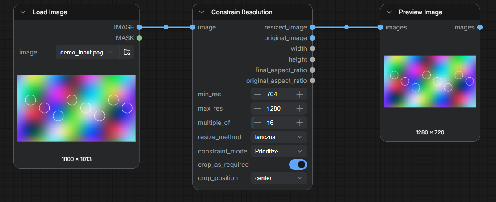
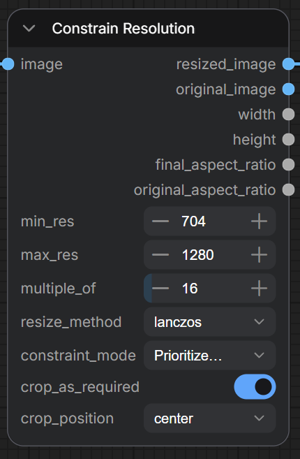

# ComfyUI Constrain Resolution

A [ComfyUI](https://github.com/comfyanonymous/ComfyUI) node that resizes any image to fit your model's resolution rules: a minimum size, a maximum size, and dimensions guaranteed divisible by 2, 8, 16, 32, or 64. It keeps the aspect ratio by cropping a few pixels when needed, so the output is always exactly what strict image-to-image and image-to-video models expect.



In the example above, an 1800×1013 image becomes 1280×720 — within the 704–1280 limits, both dimensions divisible by 16, aspect ratio intact.

## Why

Many models fail or degrade when dimensions are wrong:

- Image-to-video models often require exact sizes with dimensions divisible by 8 or 16
- Diffusion models (Flux, SD, etc.) need dimensions divisible by at least 2, and some run faster at 32/64 alignment
- VRAM limits mean you need a hard cap on resolution

This node applies all three rules in one step and **guarantees divisibility on every output** — resize, round, and crop all land on multiples of your chosen number.

## Inputs



| Input | Default | Purpose |
|---|---|---|
| `image` | — | Image (or batch) to resize |
| `min_res` | 704 | Neither dimension will end up below this |
| `max_res` | 1280 | Bounds the longest side. In the default mode the long side may exceed it on extreme aspect ratios — see constraint modes below |
| `multiple_of` | 2 | Output width and height are always divisible by this (1 disables) |
| `resize_method` | lanczos | Interpolation: `lanczos` (sharpest), `bicubic`, `bilinear`, `nearest-exact` (pixel art/masks), `area` (big downscales) |
| `constraint_mode` | Prioritize Min Resolution | What wins when an extreme aspect ratio can't satisfy both limits (see below) |
| `crop_as_required` | True | Crop minimally to hit exact dimensions instead of distorting the aspect ratio |
| `crop_position` | center | Which part to keep when cropping: center / top / bottom / left / right |

Every image is rescaled so its longest side lands on `max_res` — images already inside the range are resized too, not passed through. This is what makes the output size predictable for batching.

**Constraint modes** — with a very wide or very tall image, min and max can conflict:

- **Prioritize Min Resolution**: neither dimension goes below `min_res`, even if the long side must exceed `max_res`. Best default. At the default settings, beyond roughly a 52:1 aspect ratio the required output would be large enough to exhaust memory, so the node reports an error instead of trying — switch to Strict mode for those. The limit scales with `max_res` up to an absolute ceiling of 64 MP, and never refuses an output that fits inside your own `max_res × max_res` box.
- **Prioritize Max Resolution (Strict)**: output always fits in a `max_res × max_res` box (hard VRAM cap), even if the short side lands below `min_res`.

## Outputs

| Output | Description |
|---|---|
| `resized_image` | The constrained image — your main output |
| `original_image` | Untouched input passthrough |
| `width`, `height` | Final dimensions (handy for downstream nodes) |
| `final_aspect_ratio`, `original_aspect_ratio` | For monitoring how much the ratio changed |

## Quick recipes

- **Image-to-video prep**: `min_res=768, max_res=1024, multiple_of=16` — exact, divisible dimensions every time
- **Hard VRAM cap**: `max_res=1024, constraint_mode=Prioritize Max Resolution (Strict)`
- **Keep every pixel** (no cropping): `crop_as_required=False, multiple_of=1`
- **Headshots**: `crop_position=top` keeps faces when cropping portraits

## Installation

**ComfyUI Manager**: search for "Constrain Resolution" and install.

**Manual**:
```bash
cd ComfyUI/custom_nodes
git clone https://github.com/EnragedAntelope/ComfyUI-ConstrainResolution.git
```
Restart ComfyUI. No dependencies beyond ComfyUI itself (Python 3.10+).

## Notes

- Resizing uses ComfyUI's own resizer (`comfy.utils.common_upscale`), so results match core resize nodes; bicubic/lanczos output is clamped to the valid range to avoid overshoot artifacts.
- Divisibility, min/max, and crop dimensions are enforced together — the reported `width`/`height` always match the actual output tensor.
- Built on the ComfyUI v3 node API (`comfy_api.latest`).
- Impossible settings fail with a clear error rather than silently passing the image through — e.g. `multiple_of` larger than `max_res` in Strict mode, where no valid output size exists.

## Version history

- **v2.4.1**: Invalid settings are now rejected when the workflow is queued instead of mid-execution — `multiple_of` above `max_res` in Strict mode, plus out-of-range `min_res`/`max_res`/`multiple_of` and unknown constraint modes coming from hand-written API workflows, which the widget bounds alone no longer covered; the memory guard gained an absolute 64 MP ceiling, so it stays meaningful at large `max_res` instead of permitting multi-gigabyte outputs; large-upscale warnings now fire in Strict mode too, so tiny sources blown up 10x+ are no longer silent; CI hardening (GitHub Actions pinned by commit SHA, pip dependency caching, torch bounded to known-good majors); new tests keep the node schema in sync with `execute()` and enforce tooltips on every input
- **v2.4.0**: Refuse extreme-aspect-ratio upscales that would exhaust memory instead of attempting them (a 1×690 input at default settings previously asked for 704×485760, roughly 4 GB per batch item); fixed settings that silently passed the image through untouched (`multiple_of` above `max_res` in Strict mode, and thin strips at `multiple_of=1`); restored ComfyUI's built-in range and combo-option validation, which the previous `validate_inputs` signature disabled for every input; ~1.85× faster when cropping by dropping a resize whose result was discarded; crop decisions now use exact aspect ratios instead of 4-decimal rounded ones
- **v2.3.2**: Added CI test workflow (pytest on Python 3.10–3.12); warn on very large upscales in "Prioritize Min Resolution" mode; pass malformed zero-dimension inputs through unchanged instead of erroring
- **v2.3.1**: Rewrote README with current screenshots; enforce `min_res` even when rounding to a large `multiple_of` would dip below it
- **v2.3.0**: Added `resize_method` selection (lanczos default); fixed a rare off-by-one in cropped output size; removed unused numpy dependency; Python 3.10 compatibility; proper logging
- **v2.2**: Fixed strict max-resolution mode exceeding `max_res` after rounding; added test suite
- **v2.1.0**: Image resizing, smart cropping, crop position control, tooltips, input validation
- **v2.0.0**: Migrated to ComfyUI v3 specification
- **v1.1**: Initial release

## License

See [LICENSE](LICENSE). Issues and PRs welcome on [GitHub](https://github.com/EnragedAntelope/ComfyUI-ConstrainResolution/issues).
